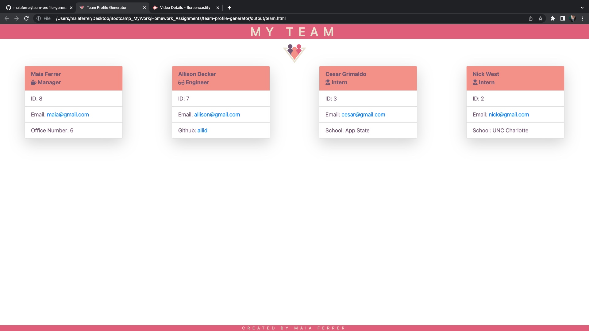

# Team Profile Generator
[](https://github.com/Naereen/StrapDown.js/blob/master/LICENSE)



## Project Description
This project is a Node.js command-line application that takes in a managers team information regarding their github, employee id, educational background, email, and office number. After the employee information is collected via the command-line, then a HTML file will be generated.

The Html file displays in the browser with a professional and unique UI that maximizes usage. The web application curated is also responsive and can be used on your preferred device. 

Furthermore, tests were curated for each employee title using Jest.

Give it a try!

Watch a User Demo [HERE](https://youtu.be/CHCe77cbL7Y)

## Usage information
1. User must first install the `inquierer` using the following command in the integrated terminal: 
`npm i inquirer`

2. The application will then be invoked using the following command:
`node index.js`

3. Then, the user must answer the questions that are prompted in the command-line and add an employee when necessary. 

4. A line reading `The team generator file has been successfully completed!` will be produce informing the user of a successful file generated.

5. User must look in the `team.html` file to see their uniquely curated team profile.

## User Story
```
AS A manager
I WANT to generate a webpage that displays my team's basic info
SO THAT I have quick access to their emails and GitHub profiles
```

## Acceptance Criteria
```
GIVEN a command-line application that accepts user input
WHEN I am prompted for my team members and their information
THEN an HTML file is generated that displays a nicely formatted team roster based on user input
WHEN I click on an email address in the HTML
THEN my default email program opens and populates the TO field of the email with the address
WHEN I click on the GitHub username
THEN that GitHub profile opens in a new tab
WHEN I start the application
THEN I am prompted to enter the team manager’s name, employee ID, email address, and office number
WHEN I enter the team manager’s name, employee ID, email address, and office number
THEN I am presented with a menu with the option to add an engineer or an intern or to finish building my team
WHEN I select the engineer option
THEN I am prompted to enter the engineer’s name, ID, email, and GitHub username, and I am taken back to the menu
WHEN I select the intern option
THEN I am prompted to enter the intern’s name, ID, email, and school, and I am taken back to the menu
WHEN I decide to finish building my team
THEN I exit the application, and the HTML is generated
```

## Important Links

- [GitHub Repository](https://github.com/maiaferrer/team-profile-generator)
- [Demo](https://youtu.be/CHCe77cbL7Y)

## Technology used


## Contact Me

For further quesitons contact me at: maiaferrer604@gmail.com or
[Github](https://github.com/maiaferrer) or
[Linkedin](https://www.linkedin.com/in/maia-f-2b7aa710a)